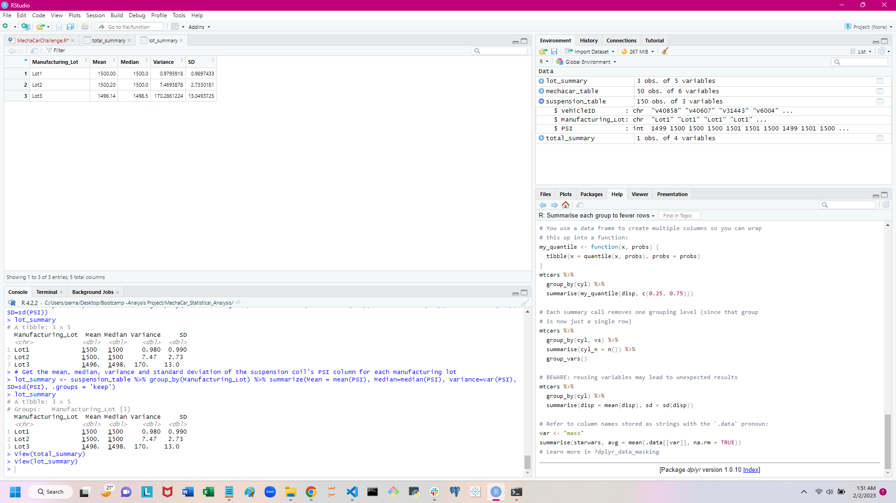

# MechaCar_Statistical_Analysis

## Linear Regression to Predict MPG

1. Which variables/coefficients provided a non-random amount of variance to the mpg values in the dataset?

    The vehicle_length and ground_clearence provide a non-random amount of variance to the mpg values as the "Pr(>|t|)" values for these individual variables are considerably low.

2. Is the slope of the linear model considered to be zero? Why or why not?

    The slope of the linear model is considered non-zero as the p-value is 5.35e-11 which is considerably lower than the significance level of 0.05. 

3. Does this linear model predict mpg of MechaCar prototypes effectively? Why or why not?

    Since the R-squared value is 0.7149, there is a 71% chance that the mpg predictions will be correct using this linear Regression model. 

## Summary Statistics on Suspension Coils

* The design specifications for the MechaCar suspension coils dictate that the variance of the suspension coils must not exceed 100 pounds per square inch. Does the current manufacturing data meet this design specification for all manufacturing lots in total and each lot individually? Why or why not?

    The variance of the suspension coils for all manufacturing lots is 62.29356 which is less than 100, hence it meets the design specification.

    However, when the variance is calculated for individual lots, we see that Lot1 and Lot2 are within the design specification. The variance for Lot3 is 170.2861224 which is higher than 100. Hence Lot3 fails to meet the design specification regarding the variance.

## T-Tests on Suspension Coils

 A sample of 50 was selected from the population and a One sample t-test was performed. The p-value of 0.2909 is higher than the significance level of 0.05. Hence it can be inferred that there is no statistical difference between the PSI across all manufacturing lots and the population mean of 1500 pounds per sqaure inch.

Selecting only the data for Manufacturing Lot = 'Lot1', a One Sample t-test was performed. As the p-value of 1.568e-11 is significantly less than the significance level of 0.05, we reject the Null Hypothesis and infer that there is a statistical difference between the PSI of Lot1 and the population mean of 1500 pounds per square inch.

Selecting only the data for Manufacturing Lot = 'Lot2', a One Sample t-test was performed. As the p-value of 0.0005911 is less than the significance level of 0.05, we reject the Null Hypothesis and infer that there is a statistical difference between the PSI of Lot2 and the population mean of 1500 pounds per square inch.

Selecting only the data for Manufacturing Lot = 'Lot3', a One Sample t-test was performed. As the p-value of 0.1589 is greater than the significance level of 0.05, we accept the Null Hypothesis and infer that there is no statistical difference between the PSI of Lot3 and the population mean of 1500 pounds per square inch.

## Study Design: MechaCar vs Competition

In order to compare the performance of MechaCar against the competition, several metrics could be used. From a consumers perspective miles per gallon would be one important metric. 

The null hypothesis or H0 is that there no statistical difference in 'mpg' between MechaCar and its competitior.

The alternative hypothesis or Ha is that there is a statistical difference in 'mpg' between MechaCar and its competitor.

To test this hypothesis, the "Two sample pair t-test" can be used since we are working with two different population.

Assuming our dataset contains data from MechaCar and it's competitor (XYZ), the first step would be to create the two data samples - one for MechaCar and the other for XYZ.

Then using the t.test() function of R, compare the 'mpg' for both samples with paired = 'True' option and calculate the p-value. If the p-value is greater than the significane level (0.05), then we don't have enough evidence to reject the null hypothesis and there is no overall difference in 'mpg' between MechaCar and the competitor.

